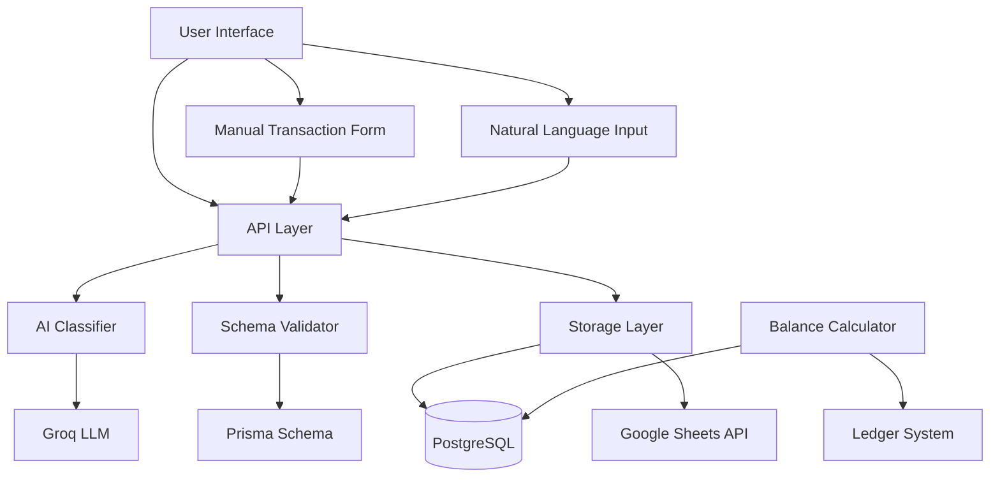
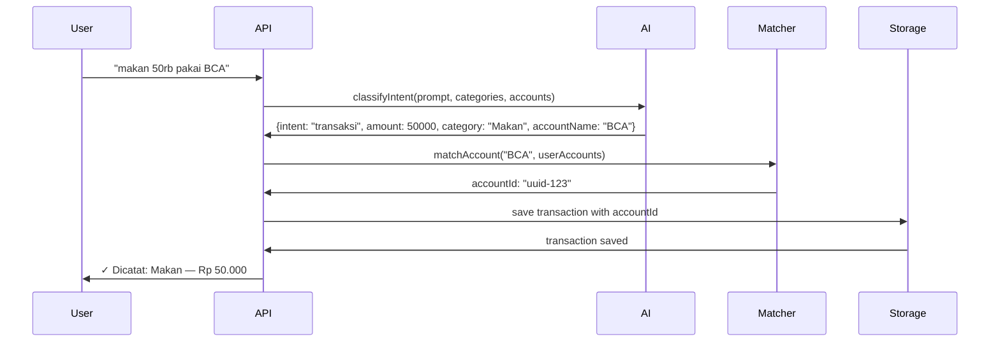
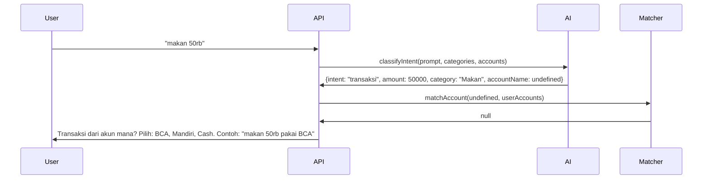
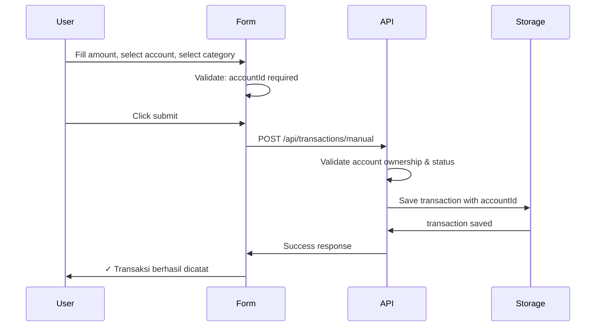

# Design Document: Double-Entry Accounting System

## Overview

This design document outlines the technical architecture for migrating the Catatuang transaction system from single-entry to double-entry accounting. The migration introduces mandatory account association for all transactions, AI-powered account extraction from natural language input, and proper double-entry bookkeeping principles.

### Core Principles

**Double-Entry Accounting**: Every transaction affects at least two accounts with balanced amounts. This ensures:
- Accurate tracking of money flow between accounts
- Real-time account balance calculation via ledger
- Support for credit card liability tracking
- Foundation for future financial reporting features

**Backward Compatibility**: The system maintains compatibility with:
- Existing ledger-based balance calculation (`utils/account-balance.ts`)
- Google Sheets integration for Google OAuth users
- Database storage for email/password users
- Legacy transactions with null accountId (excluded from balance calculations)

### Key Changes

1. **Schema**: `Transaction.accountId` becomes required (non-nullable) for new transactions
2. **AI Classification**: Enhanced to extract account names from natural language
3. **Manual Form**: Account selection becomes mandatory with improved UX
4. **API**: Account validation and clarification flow for missing accounts
5. **Balance Calculation**: Preserved ledger-based approach with accountId filtering

### Migration Strategy

The system will transition from optional to mandatory accountId through a phased approach:

1. **Phase 1 (Current)**: accountId is optional, new transactions encouraged to include it
2. **Phase 2 (This Migration)**: accountId becomes required for all new transactions
3. **Phase 3 (Future)**: Legacy data migration tools to assign accounts to historical transactions

This approach ensures zero downtime and allows users to gradually adopt the new system.

## Architecture

### System Components



### Component Responsibilities

**API Layer** (`app/api/record/route.ts`, `app/api/transactions/manual/route.ts`):
- Receives transaction requests from UI
- Orchestrates AI classification and account matching
- Validates account ownership and status
- Persists transactions to storage
- Returns clarification requests when account is missing

**AI Classifier** (`utils/groq.ts`):
- Extracts transaction intent, amount, category, date, and account name from natural language
- Receives user's available accounts as context
- Returns structured JSON with accountName field when account is mentioned
- Leaves accountName undefined when no account is mentioned

**Schema Validator** (`prisma/schema.prisma`):
- Enforces accountId requirement at database level for new transactions
- Maintains foreign key constraints
- Handles legacy data with null accountId gracefully

**Storage Layer** (`utils/db-transactions.ts`, `utils/sheets.ts`):
- Dual storage: PostgreSQL for email users, Google Sheets for OAuth users
- Consistent transaction structure across both storage types
- Account data included in all transaction records

**Balance Calculator** (`utils/account-balance.ts`):
- Pure ledger-based calculation: balance = Σ(income + transfer_in) - Σ(expense + transfer_out)
- Filters transactions by accountId
- Excludes legacy transactions with null accountId from balance calculation
- Supports both asset and liability accounts

**Manual Form** (`components/ManualTransactionForm.tsx`):
- Three tabs: Expense, Income, Transfer
- Account selection dropdown grouped by AccountType
- Validation: prevents submission without account selection
- Displays helpful messages when no accounts exist

### Data Flow

#### AI-Powered Transaction Flow



#### Missing Account Clarification Flow



#### Manual Form Transaction Flow



## Components and Interfaces

### AI Classifier Interface

**Location**: `utils/groq.ts`

**Enhanced ParsedRecord Interface**:
```typescript
export interface ParsedRecord {
  intent: "transaksi" | "transaksi_bulk" | "pemasukan" | "budget_setting" | "laporan" | "unknown";
  
  // Expense transaction
  amount?: number;
  category?: string;
  note?: string;
  date?: string; // YYYY-MM-DD
  accountName?: string; // NEW: extracted account name from user input
  
  // Bulk transaction
  items?: Array<{ amount: number; category: string; note?: string }>;
  
  // Income transaction
  incomeAmount?: number;
  incomeCategory?: string;
  
  // Budget setting
  budgetCategory?: string;
  budgetAmount?: number;
  
  // Report
  period?: string;
  reportType?: "summary" | "per_category" | "analisis";
  
  // Unknown intent
  clarification?: string;
}
```

**Enhanced System Prompt** (Rule 10):
```
10. EXTRACT AKUN: Jika user menyebut nama akun/bank/dompet/kartu kredit, extract ke field "accountName".
   Contoh:
   - "makan 50rb pakai BCA" → accountName: "BCA"
   - "bayar pakai Mandiri" → accountName: "Mandiri"
   - "dari cash" → accountName: "cash"
   - "pakai kartu kredit BNI" → accountName: "BNI"
   - "dari dompet" → accountName: "dompet"
   Jika TIDAK disebutkan, JANGAN isi accountName (biarkan undefined/null).
```

**Function Signature**:
```typescript
export async function classifyIntent(
  prompt: string,
  userCategories?: string[],
  userAccounts?: string[] // NEW: list of user's account names
): Promise<ParsedRecord>
```

### Account Matching Logic

**Location**: `app/api/record/route.ts`

**Implementation**:
```typescript
function matchAccount(accountName?: string, userAccounts: Array<{id: string, name: string}>): string | null {
  if (!accountName) return null;
  
  const normalized = accountName.toLowerCase().trim();
  const found = userAccounts.find((a) => 
    a.name.toLowerCase().includes(normalized) || 
    normalized.includes(a.name.toLowerCase())
  );
  
  return found?.id ?? null;
}
```

**Matching Strategy**:
- Case-insensitive partial matching
- Bidirectional: "BCA" matches "BCA Savings" and vice versa
- Returns first match (assumes unique account names per user)
- Returns null if no match found

### Clarification Message Generator

**Location**: `app/api/record/route.ts`

**Implementation**:
```typescript
function askAccountSelection(
  transactionType: "expense" | "income",
  userAccounts: Array<{name: string}>,
  originalPrompt: string
): string {
  if (userAccounts.length === 0) {
    return "Belum ada akun. Buat akun dulu di menu Akun sebelum input transaksi.";
  }
  
  const label = transactionType === "income" ? "masuk ke akun mana" : "dari akun mana";
  const accountList = userAccounts.map((a) => a.name).join(", ");
  const example = `${originalPrompt} pakai ${userAccounts[0].name}`;
  
  return `Transaksi ${label}? Pilih salah satu: ${accountList}. Contoh: "${example}"`;
}
```

**Clarification Types**:
1. **No accounts exist**: Directs user to create account first
2. **Account not mentioned (expense)**: "Transaksi dari akun mana? Pilih salah satu: [list]. Contoh: '[prompt] pakai [first account]'"
3. **Account not mentioned (income)**: "Transaksi masuk ke akun mana? Pilih salah satu: [list]. Contoh: '[prompt] pakai [first account]'"
4. **Multiple matches**: "Akun mana yang dimaksud? [matched accounts]. Contoh: '[prompt] pakai [first match]'"

### Manual Form Component

**Location**: `components/ManualTransactionForm.tsx`

**Key Features**:
- Three tabs: Expense, Income, Transfer
- Account dropdown grouped by AccountType using `<optgroup>`
- Submit button disabled when no account selected
- Zero-account state: displays message and link to create account
- Transfer validation: prevents same source and destination account
- Cross-currency transfer warning

**Account Dropdown Structure**:
```tsx
<select value={accountId} onChange={(e) => setAccountId(e.target.value)} required>
  <option value="">Pilih akun</option>
  {Object.entries(accountsByType).map(([typeName, accounts]) => (
    <optgroup key={typeName} label={typeName}>
      {accounts.map((a) => (
        <option key={a.id} value={a.id}>{a.name}</option>
      ))}
    </optgroup>
  ))}
</select>
```

### Transaction API Endpoints

**POST /api/record** (AI-powered natural language input):
- Accepts: `{ prompt: string }`
- Returns: Transaction object or clarification request
- Validates account ownership and status
- Handles bulk transactions with single accountId

**POST /api/transactions/manual** (Manual form submission):
- Accepts: `{ type, amount, accountId, toAccountId?, category?, date, note }`
- Returns: Transaction object or error
- Validates account ownership and status
- Handles expense, income, and transfer types

**Validation Rules** (both endpoints):
1. accountId must reference an existing account
2. Account must belong to authenticated user
3. Account must be active (isActive = true)
4. For transfers: source and destination must be different
5. For transfers: currencies must match (cross-currency not supported)

## Data Models

### Database Schema Changes

**Transaction Model** (Prisma):
```prisma
model Transaction {
  id               String   @id @default(uuid())
  userId           String   @map("user_id")
  date             String   // YYYY-MM-DD
  amount           Decimal  @db.Decimal(19, 4)
  category         String
  note             String   @default("")
  type             String   @default("expense") // "expense" | "income" | "transfer_out" | "transfer_in"
  accountId        String?  @map("account_id")  // NULLABLE for legacy data, REQUIRED for new transactions
  transferId       String?  @map("transfer_id")
  isInitialBalance Boolean  @default(false) @map("is_initial_balance")
  createdAt        DateTime @default(now()) @map("created_at")

  user    User     @relation(fields: [userId], references: [id], onDelete: Cascade)
  account Account? @relation(fields: [accountId], references: [id], onDelete: SetNull)

  @@index([userId, accountId])
  @@index([userId, date])
  @@index([transferId])
  @@map("transactions")
}
```

**Key Schema Decisions**:
- `accountId` remains nullable in schema to support legacy data
- Application layer enforces accountId requirement for new transactions
- `onDelete: SetNull` preserves transaction history when account is deleted
- Indexes on `[userId, accountId]` for efficient balance calculation queries

### Account Model

**Existing Schema** (no changes required):
```prisma
model Account {
  id             String   @id @default(uuid())
  userId         String   @map("user_id")
  accountTypeId  String   @map("account_type_id")
  name           String
  initialBalance Decimal  @default(0) @db.Decimal(19, 4) @map("initial_balance")
  currency       String   @default("IDR")
  color          String?
  icon           String?
  note           String   @default("")
  isActive       Boolean  @default(true) @map("is_active")
  createdAt      DateTime @default(now()) @map("created_at")
  updatedAt      DateTime @updatedAt @map("updated_at")

  tanggalSettlement Int? @map("tanggal_settlement")  // 1-31, for credit cards
  tanggalJatuhTempo Int? @map("tanggal_jatuh_tempo") // 1-31, for credit cards

  user         User          @relation(fields: [userId], references: [id], onDelete: Cascade)
  accountType  AccountType   @relation(fields: [accountTypeId], references: [id], onDelete: Restrict)
  transactions Transaction[]

  @@index([userId, isActive])
  @@index([accountTypeId])
  @@map("accounts")
}
```

### AccountType Model

**Existing Schema** (no changes required):
```prisma
model AccountType {
  id             String   @id @default(uuid())
  userId         String   @map("user_id")
  name           String
  classification String   // "asset" | "liability"
  icon           String   @default("wallet")
  color          String   @default("#6366f1")
  sortOrder      Int      @default(0) @map("sort_order")
  isActive       Boolean  @default(true) @map("is_active")
  createdAt      DateTime @default(now()) @map("created_at")
  updatedAt      DateTime @updatedAt @map("updated_at")

  user     User      @relation(fields: [userId], references: [id], onDelete: Cascade)
  accounts Account[]

  @@unique([userId, name])
  @@index([userId, isActive])
  @@map("account_types")
}
```

### Google Sheets Data Structure

**Akun Sheet** (existing):
```
Columns: id | name | type | classification | balance | currency | color | note
```

**Transaksi Sheet** (enhanced):
```
Columns: id | date | amount | category | note | type | accountId | accountName | transferId
```

**New Columns**:
- `accountId`: UUID reference to account
- `accountName`: Human-readable account name for display

**Backward Compatibility**:
- Legacy rows without accountId/accountName are preserved
- New transactions always include both fields
- Balance calculation excludes rows with empty accountId

### Transaction Types and Account Behavior

| Transaction Type | accountId Usage | Balance Impact | Notes |
|-----------------|-----------------|----------------|-------|
| **expense** | Source account (money out) | Decreases account balance | For credit cards (liability), increases debt |
| **income** | Destination account (money in) | Increases account balance | |
| **transfer_out** | Source account | Decreases source balance | Paired with transfer_in via transferId |
| **transfer_in** | Destination account | Increases destination balance | Paired with transfer_out via transferId |

**Credit Card Special Behavior**:
- Credit card accounts have `AccountType.classification = "liability"`
- Expense on credit card: increases liability balance (debt grows)
- Transfer to credit card (payment): decreases liability balance (debt shrinks)
- Balance displayed as positive number representing debt amount


## Correctness Properties

*A property is a characteristic or behavior that should hold true across all valid executions of a system—essentially, a formal statement about what the system should do. Properties serve as the bridge between human-readable specifications and machine-verifiable correctness guarantees.*

This feature involves both pure logic (suitable for property-based testing) and integration components (better tested with example-based and integration tests). The properties below focus on the pure logic components: account matching, validation, clarification generation, and balance calculation.

### Property 1: Account Name Matching

*For any* account name string and any list of user accounts, the matching function SHALL return the account ID if and only if there exists exactly one account whose name contains the search string (case-insensitive) or the search string contains the account name.

**Validates: Requirements 2.2, 2.3**

### Property 2: Account Validation

*For any* transaction creation attempt with an accountId, the system SHALL accept the transaction if and only if: (1) the account exists, (2) the account belongs to the authenticated user, and (3) the account is active (isActive = true).

**Validates: Requirements 1.1, 1.5, 7.3, 7.4, 8.3, 8.4**

### Property 3: Clarification Message Completeness

*For any* transaction type (expense or income) and any non-empty list of active accounts, when accountId is missing, the clarification message SHALL include: (1) all active account names, (2) transaction-type-specific wording ("dari akun mana" for expense, "masuk ke akun mana" for income), and (3) an example using the first account name.

**Validates: Requirements 1.4, 2.4, 2.5, 3.2, 3.3, 3.4, 3.5**

### Property 4: Transaction Type Recording

*For any* valid transaction data with type "expense" or "income" and a valid accountId, the created transaction record SHALL have: (1) the specified type field, (2) the specified accountId, and (3) all other provided fields (amount, category, date, note) preserved exactly.

**Validates: Requirements 7.1, 8.1**

### Property 5: Ledger Balance Calculation

*For any* account and any set of transactions associated with that account, the calculated balance SHALL equal: initialBalance + Σ(income amounts) + Σ(transfer_in amounts) - Σ(expense amounts) - Σ(transfer_out amounts), where transactions with null accountId are excluded from the calculation.

**Validates: Requirements 7.2, 8.2, 9.4, 9.5, 14.1, 14.2, 14.5**

### Property 6: Transfer Transaction Pairing

*For any* valid transfer request with source accountId, destination accountId, and amount, the system SHALL create exactly two transactions: (1) a transfer_out transaction with the source accountId, and (2) a transfer_in transaction with the destination accountId, both sharing the same transferId and having the same amount.

**Validates: Requirements 9.1, 9.2, 9.3**

### Property 7: Transfer Validation

*For any* transfer request, the system SHALL accept the transfer if and only if: (1) source accountId ≠ destination accountId, (2) both accounts exist and are active, (3) both accounts belong to the authenticated user, and (4) both accounts have the same currency.

**Validates: Requirements 19.1, 19.3, 19.4, 19.5**

### Property 8: Bulk Transaction Atomicity

*For any* bulk transaction request with multiple items and a single accountId, if the accountId is invalid (non-existent, inactive, or belongs to another user), then the system SHALL create zero transactions (no partial saves).

**Validates: Requirements 11.2, 11.5**

### Property 9: Credit Card Liability Balance

*For any* account with AccountType.classification = "liability", when an expense transaction is recorded, the account balance SHALL increase by the expense amount (representing increased debt), and when a transfer_in transaction is recorded (payment), the balance SHALL decrease by the transfer amount (representing decreased debt).

**Validates: Requirements 10.1, 10.2, 10.3**

### Property 10: Account Ownership Isolation

*For any* two distinct users A and B, if user A creates a transaction with an accountId belonging to user B, the system SHALL reject the transaction with an error, ensuring that users cannot access or modify each other's account data.

**Validates: Requirements 7.3, 8.3, 19.4**

## Error Handling

### Validation Errors

The system implements comprehensive validation at multiple layers:

**Schema Layer** (Prisma):
- Foreign key constraints ensure accountId references valid accounts
- Indexes optimize validation queries
- `onDelete: SetNull` preserves transaction history when accounts are deleted

**Application Layer** (API):
- Account existence validation
- Account ownership validation (userId match)
- Account status validation (isActive = true)
- Transfer-specific validation (different accounts, same currency)
- Amount validation (positive, within limits)

### Error Messages

The system provides clear, actionable error messages in Indonesian:

| Error Condition | HTTP Status | Error Message |
|----------------|-------------|---------------|
| Account not found | 400 | "Akun tidak ditemukan" |
| Account belongs to another user | 400 | "Akun tidak valid" |
| Account is inactive | 400 | "Akun sudah dinonaktifkan" |
| Transfer same account | 400 | "Akun sumber dan tujuan tidak boleh sama" |
| Cross-currency transfer | 400 | "Transfer beda mata uang belum didukung ([currency1] → [currency2]). Catat sebagai pengeluaran dan pemasukan terpisah." |
| Invalid amount | 400 | "Nominal tidak valid." |
| Missing account (clarification) | 200 | "Transaksi [dari/masuk ke] akun mana? Pilih salah satu: [list]. Contoh: '[prompt] pakai [first account]'" |
| No accounts exist | 200 | "Belum ada akun. Buat akun dulu di menu Akun sebelum input transaksi." |

### Error Recovery

**AI Classification Failures**:
- Groq API rate limit: Automatic key rotation across multiple API keys
- Groq API unavailable: Return HTTP 503 with retry message
- Invalid AI response: Return "unknown" intent with clarification request

**Storage Failures**:
- Google Sheets API failure: Return HTTP 500 with user-friendly message
- Database connection failure: Return HTTP 500 with retry message
- Transaction rollback on partial failure (bulk transactions)

**Legacy Data Handling**:
- Transactions with null accountId are preserved but excluded from balance calculations
- Balance calculation queries filter `WHERE accountId IS NOT NULL`
- Admin tools (future) will allow assigning accounts to legacy transactions

## Testing Strategy

### Unit Tests

**Focus Areas**:
- Account matching logic (`matchAccount` function)
- Clarification message generation (`askAccountSelection` function)
- Validation functions (account ownership, status, transfer rules)
- Error message formatting
- Edge cases: empty account lists, special characters in account names, case sensitivity

**Test Framework**: Jest (existing project setup)

**Example Unit Tests**:
```typescript
describe('matchAccount', () => {
  it('should match account name case-insensitively', () => {
    const accounts = [{ id: '1', name: 'BCA Savings' }];
    expect(matchAccount('bca', accounts)).toBe('1');
  });
  
  it('should return null when no match found', () => {
    const accounts = [{ id: '1', name: 'BCA' }];
    expect(matchAccount('mandiri', accounts)).toBeNull();
  });
  
  it('should match partial names bidirectionally', () => {
    const accounts = [{ id: '1', name: 'BCA Savings' }];
    expect(matchAccount('BCA', accounts)).toBe('1');
    expect(matchAccount('Savings', accounts)).toBe('1');
  });
});
```

### Property-Based Tests

**Test Library**: fast-check (TypeScript property-based testing library)

**Configuration**: Minimum 100 iterations per property test

**Property Test Implementation**:

Each property test must include a comment tag referencing the design document property:
```typescript
// Feature: double-entry-accounting-system, Property 1: Account Name Matching
```

**Example Property Tests**:

```typescript
import fc from 'fast-check';

describe('Property 1: Account Name Matching', () => {
  it('should match exactly one account when search string is unique', () => {
    // Feature: double-entry-accounting-system, Property 1: Account Name Matching
    fc.assert(
      fc.property(
        fc.array(fc.record({ id: fc.uuid(), name: fc.string({ minLength: 1 }) })),
        fc.string({ minLength: 1 }),
        (accounts, searchName) => {
          const matches = accounts.filter(a => 
            a.name.toLowerCase().includes(searchName.toLowerCase()) ||
            searchName.toLowerCase().includes(a.name.toLowerCase())
          );
          
          const result = matchAccount(searchName, accounts);
          
          if (matches.length === 1) {
            expect(result).toBe(matches[0].id);
          } else {
            expect(result).toBeNull();
          }
        }
      ),
      { numRuns: 100 }
    );
  });
});

describe('Property 5: Ledger Balance Calculation', () => {
  it('should calculate balance as sum of income minus sum of expenses', () => {
    // Feature: double-entry-accounting-system, Property 5: Ledger Balance Calculation
    fc.assert(
      fc.property(
        fc.uuid(), // accountId
        fc.array(fc.record({
          type: fc.constantFrom('income', 'expense', 'transfer_in', 'transfer_out'),
          amount: fc.float({ min: 0.01, max: 1000000 }),
          accountId: fc.uuid()
        })),
        (accountId, transactions) => {
          const accountTxs = transactions.filter(t => t.accountId === accountId);
          
          let expectedBalance = 0;
          for (const tx of accountTxs) {
            if (tx.type === 'income' || tx.type === 'transfer_in') {
              expectedBalance += tx.amount;
            } else if (tx.type === 'expense' || tx.type === 'transfer_out') {
              expectedBalance -= tx.amount;
            }
          }
          
          const calculatedBalance = calculateAccountBalance(accountId, transactions);
          expect(calculatedBalance).toBeCloseTo(expectedBalance, 2);
        }
      ),
      { numRuns: 100 }
    );
  });
});
```

### Integration Tests

**Focus Areas**:
- Google Sheets API integration (with mocked Sheets API)
- Database transaction creation and retrieval
- AI classification (with mocked Groq API)
- End-to-end transaction flows (AI input → storage → balance calculation)

**Test Strategy**:
- Use test database for database integration tests
- Mock external APIs (Groq, Google Sheets) for predictable testing
- Test both Google OAuth users (Sheets) and email users (database)
- Verify backward compatibility with legacy data

### Manual Testing Checklist

**Account Matching**:
- [ ] Test with various account name formats (bank names, "Cash", "Dompet", etc.)
- [ ] Test case-insensitive matching
- [ ] Test partial matching (both directions)
- [ ] Test with multiple accounts with similar names
- [ ] Test with special characters in account names

**Clarification Flow**:
- [ ] Test expense without account mention
- [ ] Test income without account mention
- [ ] Test bulk transaction without account mention
- [ ] Test with zero accounts (should direct to account creation)
- [ ] Verify clarification message format and examples

**Manual Form**:
- [ ] Test account dropdown grouping by type
- [ ] Test submit button disabled without account selection
- [ ] Test zero-account state message and link
- [ ] Test transfer validation (same account prevention)
- [ ] Test cross-currency transfer warning

**Balance Calculation**:
- [ ] Create expense, verify balance decreases
- [ ] Create income, verify balance increases
- [ ] Create transfer, verify both accounts update correctly
- [ ] Test credit card expense (liability balance increases)
- [ ] Test credit card payment (liability balance decreases)
- [ ] Verify legacy transactions (null accountId) excluded from balance

**Error Handling**:
- [ ] Test with invalid accountId
- [ ] Test with inactive account
- [ ] Test with another user's account
- [ ] Test transfer with same source and destination
- [ ] Test cross-currency transfer
- [ ] Verify error messages are clear and actionable

### Regression Testing

**Critical Paths to Preserve**:
- Existing balance calculation logic (`utils/account-balance.ts`) must remain unchanged
- Google Sheets integration must continue working for existing users
- Database storage must continue working for email users
- Existing transaction types (expense, income, transfer) must work as before
- Category management must remain functional

**Regression Test Suite**:
- Run existing test suite before and after migration
- Verify balance calculations match pre-migration values
- Test with production-like data (anonymized)
- Verify no breaking changes to API contracts
