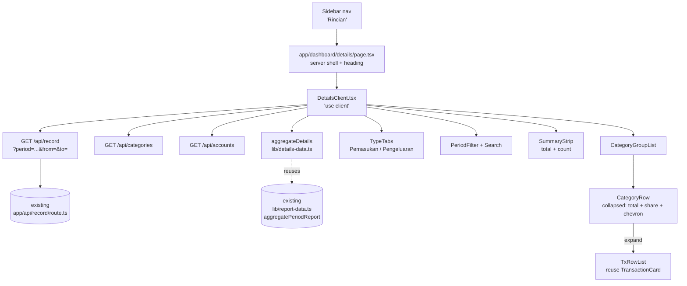
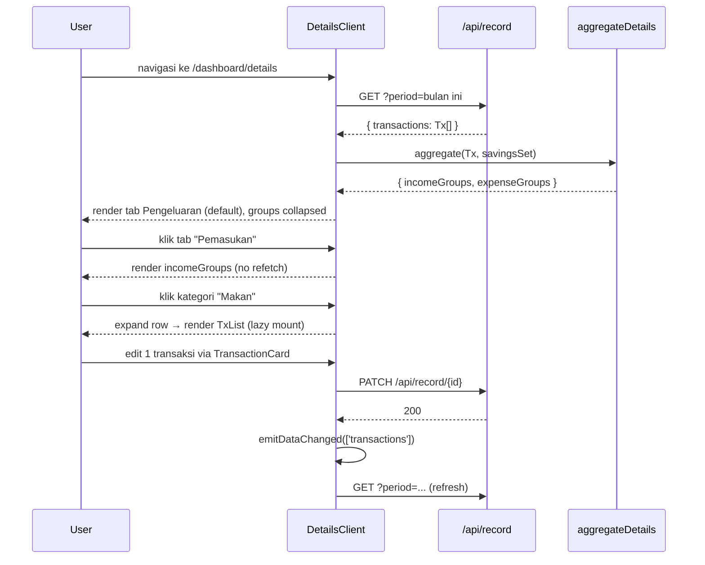
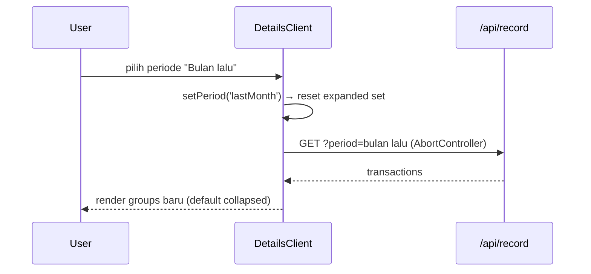

# Design Document: Rincian Pemasukan & Pengeluaran (income-expense-details)

## Overview

Halaman baru `/dashboard/details` yang menyatukan rincian **Pemasukan** dan **Pengeluaran** dalam satu page dengan sub-tab. Default view: rincian dikelompokkan per **kategori**; setiap baris kategori dapat di-expand (accordion) untuk menampilkan transaksi anggotanya. Halaman juga menyediakan filter periode (mengikuti pola `TransactionsClient`) dan ringkasan total + share kontribusi tiap kategori.

Halaman ini mengisi gap antara `/dashboard/transactions` (flat list, semua tipe) dan `/dashboard/report` (income statement formal untuk print). Fokusnya: **drill-down cepat per kategori untuk satu tipe transaksi sekaligus**, tanpa kehilangan akses ke detail row.

Implementasi memaksimalkan reuse: data dari `GET /api/record?period=...` (sudah ada) dan agregasi client-side via `aggregatePeriodReport` di `lib/report-data.ts` (sudah ada) — **tidak perlu endpoint baru**.

## Architecture



### Data Flow

1. Client mount → fetch transaksi periode aktif via `/api/record`, fetch categories & accounts.
2. Filter (search, akun, kategori) diterapkan di client → menghasilkan `filteredTx`.
3. `aggregateDetails(filteredTx, savingsSet)` membagi jadi `incomeGroups` & `expenseGroups` (per kategori, sorted desc).
4. Sub-tab aktif (`income | expense`) menentukan groups mana yang dirender.
5. Klik baris kategori → toggle expand → render transaksi via `TransactionCard` (komponen yang sudah ada, mendukung edit/delete inline).

## Sequence Diagrams

### Initial load + drill-down



### Pergantian periode



## Components and Interfaces

### 1. `app/dashboard/details/page.tsx`

**Purpose**: Server shell + page heading, mounts client component.

**Responsibilities**:
- Render heading "Rincian Pemasukan & Pengeluaran" (mengikuti pola `report/page.tsx`).
- Render `<DetailsClient />` di dalam `<Suspense>`.
- Tidak mengakses data — semua fetch di client (konsisten dengan `transactions/page.tsx`).

### 2. `app/dashboard/details/DetailsClient.tsx`

**Purpose**: Komponen interaktif utama.

**Interface**:
```typescript
type DetailType = "income" | "expense";
type Period = "today" | "week" | "month" | "lastMonth" | "custom";

interface DetailsClientProps {
  // No props — self-contained, fetches own data
}
```

**Responsibilities**:
- Manage state: `activeTab`, `period`, `customFrom/To`, `searchQuery`, `accountFilter`, `expandedKeys: Set<string>`.
- Fetch transactions, categories, accounts (with `AbortController`, `useDataEvent`).
- Apply filters → memoized `filteredTx`.
- Call `aggregateDetails` → memoized `{ incomeGroups, expenseGroups }`.
- Render tab bar, filter bar, summary strip, group list.
- Handle delete/update propagation (mirror `TransactionsClient`).

### 3. `app/dashboard/details/TypeTabs.tsx`

**Purpose**: Sub-tab switcher Pemasukan / Pengeluaran.

**Interface**:
```typescript
interface TypeTabsProps {
  active: DetailType;
  onChange: (next: DetailType) => void;
  incomeTotal: number;
  expenseTotal: number;
  incomeCount: number;
  expenseCount: number;
}
```

**Responsibilities**: Render dua pill buttons dengan total + count subtitle. Mengikuti pola tab di `ReportClient.tsx`.

### 4. `app/dashboard/details/CategoryGroupList.tsx`

**Purpose**: Render daftar kategori sebagai accordion.

**Interface**:
```typescript
interface CategoryGroup {
  category: string;
  amount: number;     // total kategori
  count: number;      // jumlah transaksi
  share: number;      // 0..1 — share dari grand total tab aktif
  transactions: Transaction[];
}

interface CategoryGroupListProps {
  groups: CategoryGroup[];
  type: DetailType;
  expandedKeys: Set<string>;
  onToggle: (category: string) => void;
  categories: TransactionCategory[];
  accounts: Account[];
  onDeleteTx: (id: string) => void;
  onUpdateTx: (id: string, data: Partial<Transaction>) => void;
}
```

**Responsibilities**:
- Render `<CategoryRow>` per group.
- Lazy-mount `<TxRowList>` hanya saat group di-expand (untuk performa kalau group besar).
- Handle empty state.

### 5. `app/dashboard/details/CategoryRow.tsx`

**Purpose**: Baris ringkas satu kategori — header dari accordion item.

**Interface**:
```typescript
interface CategoryRowProps {
  group: CategoryGroup;
  type: DetailType;
  expanded: boolean;
  onToggle: () => void;
}
```

**Responsibilities**: Tampilkan nama kategori, total (warna semantik: hijau untuk income, destructive untuk expense), share bar, count badge, chevron. Click + keyboard (Enter/Space) toggle expand. Set `aria-expanded`, `aria-controls`.

### 6. `lib/details-data.ts` (new)

**Purpose**: Pure aggregation helper untuk halaman ini.

**Interface**:
```typescript
export interface DetailsAggregation {
  incomeGroups: CategoryGroup[];
  expenseGroups: CategoryGroup[];
  incomeTotal: number;
  expenseTotal: number;
}

export function aggregateDetails(
  transactions: ReportTransactionLike[],
  savingsCategoryNames: Set<string>,
): DetailsAggregation;
```

**Responsibilities**:
- Reuse rules dari `aggregatePeriodReport` (skip `Saldo Awal`, transfer principal, savings categories) — wajib agar semantik konsisten dengan `/dashboard/report`.
- Selain agregasi, **simpan list transaksi mentah per kategori** (yang `aggregatePeriodReport` tidak lakukan — itu hanya nominal total).

## Data Models

### `CategoryGroup`

```typescript
interface CategoryGroup {
  category: string;          // nama kategori, e.g. "Makan", "Gaji"
  amount: number;            // total IDR (positive)
  count: number;             // jumlah transaksi
  share: number;             // 0..1 dari grand total tab aktif
  transactions: Transaction[]; // sudah sorted desc by date+time
}
```

**Validation**:
- `amount >= 0` (nominal total selalu non-negatif).
- `count === transactions.length`.
- `0 <= share <= 1`.
- `transactions` semuanya bertipe sama dengan tab (income atau expense), tidak ada `Saldo Awal`, tidak ada transfer principal, tidak ada savings.

### `Transaction` (existing — reuse)

Diimpor dari `@/components/TransactionCard`:
```typescript
interface Transaction {
  id: string;
  date: string;          // YYYY-MM-DD
  time?: string | null;
  amount: number;
  category: string;
  note: string;
  type?: "expense" | "income" | "transfer_out" | "transfer_in";
  fromAccountId?: string | null;
  toAccountId?: string | null;
  accountId?: string | null;
  // ...
}
```

### Filter & UI State

```typescript
interface DetailsFilters {
  period: Period;
  customFrom: string;      // ISO date, kalau period === 'custom'
  customTo: string;
  searchQuery: string;     // case-insensitive, match note + category
  accountFilter: string;   // accountId atau ""
  categoryFilter: string;  // optional — narrow ke 1 kategori
}

interface DetailsUIState {
  activeTab: DetailType;
  expandedKeys: Set<string>; // set of category names yang sedang expanded
}
```

## Algorithmic Pseudocode

### Aggregation Algorithm

```pascal
ALGORITHM aggregateDetails(transactions, savingsCategoryNames)
INPUT:
  transactions: ReportTransactionLike[]
  savingsCategoryNames: Set<string>  (lowercased)
OUTPUT:
  DetailsAggregation { incomeGroups, expenseGroups, incomeTotal, expenseTotal }

BEGIN
  ASSERT transactions != null
  ASSERT savingsCategoryNames != null

  incomeMap  ← Map<string, { amount: number, txs: Transaction[] }>
  expenseMap ← Map<string, { amount: number, txs: Transaction[] }>
  incomeTotal  ← 0
  expenseTotal ← 0

  // Loop invariant:
  //   - sum(incomeMap[k].amount)  === incomeTotal
  //   - sum(expenseMap[k].amount) === expenseTotal
  //   - setiap tx yang sudah dilewati salah satu dari:
  //       (a) di-skip (Saldo Awal / amount=0 / transfer principal / savings)
  //       (b) telah dimasukkan ke tepat satu map
  FOR each tx IN transactions DO
    IF tx.category = "Saldo Awal" THEN CONTINUE
    amt ← abs(tx.amount)
    IF amt = 0 THEN CONTINUE

    IF tx.type = "income" THEN
      bucket ← incomeMap.getOrCreate(tx.category, { amount: 0, txs: [] })
      bucket.amount ← bucket.amount + amt
      bucket.txs.push(tx)
      incomeTotal ← incomeTotal + amt
      CONTINUE
    END IF

    IF NOT isExpenseTransaction(tx) THEN CONTINUE   // skips transfer principal
    IF isSavingsTransaction(tx.category, savingsCategoryNames) THEN CONTINUE

    bucket ← expenseMap.getOrCreate(tx.category, { amount: 0, txs: [] })
    bucket.amount ← bucket.amount + amt
    bucket.txs.push(tx)
    expenseTotal ← expenseTotal + amt
  END FOR

  incomeGroups  ← buildGroups(incomeMap, incomeTotal)
  expenseGroups ← buildGroups(expenseMap, expenseTotal)

  ASSERT abs(sum(incomeGroups.amount)  - incomeTotal)  < 0.01
  ASSERT abs(sum(expenseGroups.amount) - expenseTotal) < 0.01

  RETURN { incomeGroups, expenseGroups, incomeTotal, expenseTotal }
END

PROCEDURE buildGroups(map, grandTotal)
  groups ← []
  FOR each (category, bucket) IN map DO
    sortedTxs ← bucket.txs.sort(compareTransactionDateTimeDesc)
    share     ← IF grandTotal > 0 THEN bucket.amount / grandTotal ELSE 0
    groups.push({
      category,
      amount: bucket.amount,
      count: bucket.txs.length,
      share,
      transactions: sortedTxs
    })
  END FOR
  RETURN groups.sort(by amount DESC, then category ASC)
END PROCEDURE
```

**Preconditions**:
- `transactions` non-null array (boleh empty).
- `savingsCategoryNames` non-null Set (boleh empty).
- Setiap tx punya field `category`, `amount`, dan opsional `type`/`fromAccountId`/`toAccountId`.

**Postconditions**:
- Sum `amount` semua `incomeGroups` === `incomeTotal` (toleransi floating < 0.01).
- Sum `amount` semua `expenseGroups` === `expenseTotal`.
- Tidak ada kategori `"Saldo Awal"` di output.
- Tidak ada savings category di `expenseGroups` (mereka di-skip; income ke kategori savings tidak relevan dan tidak terjadi karena type=income).
- Tidak ada transfer principal di `expenseGroups`.
- Setiap `transactions[]` di group sudah sorted desc (terbaru dulu).
- Tidak memutasi input `transactions`.

**Loop Invariant**:
- Pada awal iterasi ke-`k`, setiap transaksi `transactions[0..k-1]` sudah:
  (a) di-skip karena salah satu rule, atau
  (b) sudah dimasukkan ke tepat satu bucket dengan `amount` ter-akumulasi konsisten.

### Filtering Algorithm (client-side)

```pascal
ALGORITHM applyFilters(transactions, filters)
INPUT:
  transactions: Transaction[]
  filters: DetailsFilters (search, accountFilter, categoryFilter)
OUTPUT: Transaction[] (filtered, urutan dipertahankan)

BEGIN
  q ← lowercase(filters.searchQuery.trim())

  result ← []
  FOR each tx IN transactions DO
    IF filters.accountFilter ≠ "" THEN
      matchAcc ← (tx.accountId = filters.accountFilter)
                 OR (tx.fromAccountId = filters.accountFilter)
                 OR (tx.toAccountId = filters.accountFilter)
      IF NOT matchAcc THEN CONTINUE
    END IF

    IF filters.categoryFilter ≠ "" THEN
      IF tx.category ≠ filters.categoryFilter THEN CONTINUE
    END IF

    IF q ≠ "" THEN
      hay ← lowercase((tx.note ?? "") + " " + (tx.category ?? ""))
      IF NOT hay.contains(q) THEN CONTINUE
    END IF

    result.push(tx)
  END FOR

  RETURN result
END
```

**Preconditions**: `filters` ada (field boleh string kosong).
**Postconditions**:
- Output adalah subset dari input.
- Urutan relatif dipertahankan.
- Transaksi yang lolos memenuhi *semua* filter aktif (AND).
- Tidak memutasi input.

### Expand/Collapse State Management

```pascal
ALGORITHM toggleExpand(expandedSet, category)
INPUT:
  expandedSet: Set<string>  (immutable input — produce new set)
  category: string
OUTPUT: Set<string>

BEGIN
  next ← new Set(expandedSet)
  IF next.has(category) THEN
    next.delete(category)
  ELSE
    next.add(category)
  END IF
  RETURN next
END

// Reset saat ganti tab/periode
ALGORITHM resetExpanded()
  RETURN new Set<string>()
END
```

**Postconditions**:
- `toggleExpand` idempotent dipasangkan: `toggle(toggle(s, c), c) = s`.
- Mengganti tab/periode selalu mengembalikan `expandedSet` ke kosong (mencegah ghost expansion ke kategori yang tidak ada di tab/periode baru).

## Key Functions with Formal Specifications

### `aggregateDetails(transactions, savingsCategoryNames)`

```typescript
export function aggregateDetails(
  transactions: ReportTransactionLike[],
  savingsCategoryNames: Set<string>,
): DetailsAggregation
```

**Preconditions**:
- `transactions` non-null array.
- `savingsCategoryNames` non-null Set (sudah lowercased oleh caller, sesuai konvensi `report/route.ts`).

**Postconditions**:
- `result.incomeTotal === sum(g.amount for g in result.incomeGroups)`.
- `result.expenseTotal === sum(g.amount for g in result.expenseGroups)`.
- `result.incomeGroups` & `result.expenseGroups` sorted by `amount DESC`, tie-break by `category ASC`.
- `result.incomeGroups[*].share` & `result.expenseGroups[*].share` ∈ [0, 1]; sum mendekati 1 (toleransi floating).
- Untuk setiap group `g`: `g.count === g.transactions.length` dan `g.transactions` sorted desc (terbaru dulu).
- Tidak memutasi `transactions` atau elemennya.

**Loop Invariants**: Lihat algoritma di atas.

### `applyDetailsFilters(transactions, filters)`

```typescript
export function applyDetailsFilters(
  transactions: Transaction[],
  filters: DetailsFilters,
): Transaction[]
```

**Preconditions**: `filters` non-null.

**Postconditions**:
- Output ⊆ input (subset, urutan dipertahankan).
- Tx lolos ⇔ memenuhi semua filter aktif (AND semantics).
- Tidak memutasi input.

### `<DetailsClient />`

```typescript
export default function DetailsClient(): JSX.Element
```

**Preconditions**: User authenticated (di-enforce oleh layout dashboard via session).

**Postconditions**:
- Saat mount: fetch `/api/record`, `/api/categories`, `/api/accounts` paralel.
- Re-fetch transactions saat `period`, `customFrom`, `customTo` berubah.
- Re-fetch saat menerima `useDataEvent('transactions')` (mirror `TransactionsClient`).
- Selalu cancel pending fetch saat unmount/dependency change (`AbortController`).
- Set `expandedKeys` di-reset ke `new Set()` saat tab/period berubah.

## Example Usage

### page.tsx (server shell)

```typescript
// app/dashboard/details/page.tsx
import { Suspense } from "react";
import DetailsClient from "./DetailsClient";

export const metadata = { title: "Rincian · BudgetIn" };

export default function DetailsPage() {
  return (
    <div className="mx-auto w-full max-w-6xl px-4 py-6 md:px-8 md:py-8">
      <header className="mb-5">
        <p className="label-mono text-primary">Detail</p>
        <h1 className="mt-1 text-2xl font-bold tracking-tight md:text-3xl">
          Rincian Pemasukan & Pengeluaran
        </h1>
        <p className="mt-1 text-sm text-muted-foreground">
          Drill-down per kategori, klik baris untuk lihat transaksi anggotanya.
        </p>
      </header>
      <Suspense fallback={<div className="h-64 animate-pulse rounded-2xl bg-muted" />}>
        <DetailsClient />
      </Suspense>
    </div>
  );
}
```

### DetailsClient.tsx (excerpt — wiring)

```typescript
"use client";
import { useCallback, useEffect, useMemo, useState } from "react";
import { useDataEvent, emitDataChanged } from "@/lib/data-events";
import { aggregateDetails } from "@/lib/details-data";
// ... other imports

export default function DetailsClient() {
  const [activeTab, setActiveTab] = useState<DetailType>("expense");
  const [period, setPeriod] = useState<Period>("month");
  const [customFrom, setCustomFrom] = useState("");
  const [customTo, setCustomTo] = useState("");
  const [searchQuery, setSearchQuery] = useState("");
  const [accountFilter, setAccountFilter] = useState("");
  const [expandedKeys, setExpandedKeys] = useState<Set<string>>(new Set());

  const [transactions, setTransactions] = useState<Transaction[]>([]);
  const [accounts, setAccounts] = useState<Account[]>([]);
  const [categories, setCategories] = useState<TransactionCategory[]>([]);
  const [savingsSet, setSavingsSet] = useState<Set<string>>(new Set());
  const [loading, setLoading] = useState(true);

  // Fetcher (period-aware) — pola sama dengan TransactionsClient
  const fetchTx = useCallback(async (signal?: AbortSignal) => {
    setLoading(true);
    try {
      const url = period === "custom" && customFrom && customTo
        ? `/api/record?period=custom&from=${customFrom}&to=${customTo}`
        : `/api/record?period=${encodeURIComponent(periodToApi(period))}`;
      const res = await fetch(url, { cache: "no-store", signal });
      const data = await res.json();
      setTransactions(data.transactions ?? []);
    } catch (e) {
      if ((e as Error).name !== "AbortError") setTransactions([]);
    } finally {
      if (!signal?.aborted) setLoading(false);
    }
  }, [period, customFrom, customTo]);

  useEffect(() => {
    const ctrl = new AbortController();
    fetchTx(ctrl.signal);
    return () => ctrl.abort();
  }, [fetchTx]);

  useDataEvent(["transactions", "accounts", "categories"], (topic) => {
    if (topic === "transactions") fetchTx();
    // ... refresh accounts/categories
  });

  // Reset expanded saat tab/period berubah — postcondition
  useEffect(() => { setExpandedKeys(new Set()); }, [activeTab, period, customFrom, customTo]);

  const filteredTx = useMemo(
    () => applyDetailsFilters(transactions, { searchQuery, accountFilter, categoryFilter: "" } as DetailsFilters),
    [transactions, searchQuery, accountFilter],
  );

  const agg = useMemo(
    () => aggregateDetails(filteredTx, savingsSet),
    [filteredTx, savingsSet],
  );

  const groups = activeTab === "income" ? agg.incomeGroups : agg.expenseGroups;

  return (
    <>
      <TypeTabs
        active={activeTab}
        onChange={setActiveTab}
        incomeTotal={agg.incomeTotal}
        expenseTotal={agg.expenseTotal}
        incomeCount={agg.incomeGroups.reduce((s, g) => s + g.count, 0)}
        expenseCount={agg.expenseGroups.reduce((s, g) => s + g.count, 0)}
      />
      <FilterBar period={period} onPeriodChange={setPeriod} /* ... */ />
      <CategoryGroupList
        groups={groups}
        type={activeTab}
        expandedKeys={expandedKeys}
        onToggle={(cat) => setExpandedKeys(prev => toggleExpand(prev, cat))}
        categories={categories}
        accounts={accounts}
        onDeleteTx={(id) => {
          setTransactions(prev => prev.filter(t => t.id !== id));
          emitDataChanged(["transactions", "budget", "accounts"]);
        }}
        onUpdateTx={(id, data) => {
          setTransactions(prev => prev.map(t => t.id === id ? { ...t, ...data } : t));
          emitDataChanged(["transactions", "budget", "accounts"]);
        }}
      />
    </>
  );
}
```

### lib/details-data.ts (sketsa)

```typescript
import { isExpenseTransaction } from "@/lib/transaction-classification";
import { isSavingsTransaction } from "@/lib/savings-utils";
import { compareTransactionDateTimeDesc } from "@/lib/transaction-time";
import type { ReportTransactionLike } from "@/lib/report-data";

export interface CategoryGroup {
  category: string;
  amount: number;
  count: number;
  share: number;
  transactions: ReportTransactionLike[];
}

export interface DetailsAggregation {
  incomeGroups: CategoryGroup[];
  expenseGroups: CategoryGroup[];
  incomeTotal: number;
  expenseTotal: number;
}

type Bucket = { amount: number; txs: ReportTransactionLike[] };

export function aggregateDetails(
  transactions: ReportTransactionLike[],
  savingsCategoryNames: Set<string>,
): DetailsAggregation {
  const incomeMap = new Map<string, Bucket>();
  const expenseMap = new Map<string, Bucket>();
  let incomeTotal = 0;
  let expenseTotal = 0;

  for (const tx of transactions) {
    if (tx.category === "Saldo Awal") continue;
    const amt = Math.abs(Number(tx.amount) || 0);
    if (amt === 0) continue;

    if (tx.type === "income") {
      const b = getOrCreate(incomeMap, tx.category);
      b.amount += amt;
      b.txs.push(tx);
      incomeTotal += amt;
      continue;
    }
    if (!isExpenseTransaction(tx)) continue;
    if (isSavingsTransaction(tx.category, savingsCategoryNames)) continue;

    const b = getOrCreate(expenseMap, tx.category);
    b.amount += amt;
    b.txs.push(tx);
    expenseTotal += amt;
  }

  return {
    incomeGroups: buildGroups(incomeMap, incomeTotal),
    expenseGroups: buildGroups(expenseMap, expenseTotal),
    incomeTotal,
    expenseTotal,
  };
}

function getOrCreate(m: Map<string, Bucket>, key: string): Bucket {
  let b = m.get(key);
  if (!b) { b = { amount: 0, txs: [] }; m.set(key, b); }
  return b;
}

function buildGroups(m: Map<string, Bucket>, grandTotal: number): CategoryGroup[] {
  const groups: CategoryGroup[] = [];
  for (const [category, b] of m) {
    const txs = [...b.txs].sort(compareTransactionDateTimeDesc);
    groups.push({
      category,
      amount: b.amount,
      count: b.txs.length,
      share: grandTotal > 0 ? b.amount / grandTotal : 0,
      transactions: txs,
    });
  }
  return groups.sort((a, b) =>
    b.amount - a.amount || a.category.localeCompare(b.category)
  );
}
```

### Sidebar wiring (1 baris ditambahkan)

```typescript
// components/Sidebar.tsx — di array `insightsItems`
const insightsItems: NavItem[] = [
  { name: "Arus Kas", href: "/dashboard/cashflow", icon: TrendingDown },
  { name: "Kalender", href: "/dashboard/calendar", icon: CalendarDays },
  { name: "Rincian", href: "/dashboard/details", icon: ListTree }, // ← new
  { name: "Report", href: "/dashboard/report", icon: FileText },
  { name: "AI Analyst", href: "/dashboard/analyst", icon: Sparkles, badge: "AI" },
];
```

## Correctness Properties

Properties yang harus dipertahankan oleh implementasi (kandidat untuk property-based test di tahap requirements/tasks):

```typescript
// 1. Total invariance — total per tab konsisten dengan sum of group amounts
∀ txs, savingsSet:
  let agg = aggregateDetails(txs, savingsSet)
  abs(agg.incomeTotal  - sum(agg.incomeGroups.map(g => g.amount)))  < 0.01
  ∧ abs(agg.expenseTotal - sum(agg.expenseGroups.map(g => g.amount))) < 0.01

// 2. Count integrity — count = transactions.length per group
∀ g ∈ agg.incomeGroups ∪ agg.expenseGroups:
  g.count === g.transactions.length

// 3. Share normalisasi — sum share ≈ 1 (kecuali kalau total = 0)
∀ tab ∈ {income, expense}:
  let groups = agg[tab + "Groups"]
  groups.length > 0 ⟹ abs(sum(groups.map(g => g.share)) - 1) < 0.01

// 4. Sorting — desc by amount, tie-break asc by category
∀ groups, ∀ i:
  groups[i].amount > groups[i+1].amount
  ∨ (groups[i].amount === groups[i+1].amount ∧ groups[i].category ≤ groups[i+1].category)

// 5. Konsistensi dengan /dashboard/report — agregat per kategori identik
∀ txs, savingsSet:
  let detailsAgg = aggregateDetails(txs, savingsSet)
  let reportAgg  = aggregatePeriodReport(txs, savingsSet)
  ∀ row ∈ reportAgg.income:
    let g = detailsAgg.incomeGroups.find(g => g.category === row.category)
    abs(g.amount - row.amount) < 0.01
  // (sama untuk expense)

// 6. Filter idempotency — apply 2× = apply 1×
∀ txs, filters:
  applyDetailsFilters(applyDetailsFilters(txs, filters), filters)
    deepEquals applyDetailsFilters(txs, filters)

// 7. Toggle expand involution
∀ set, cat:
  toggleExpand(toggleExpand(set, cat), cat) === set

// 8. Tidak ada kategori excluded di output
∀ g ∈ agg.expenseGroups:
  g.category ≠ "Saldo Awal"
  ∧ ¬isSavingsTransaction(g.category, savingsSet)
```

## Error Handling

### `/api/record` returns 401 (token_expired)
- **Condition**: Google user dengan refresh token kedaluwarsa.
- **Response**: Surface dengan toast / inline error "Sesi expired. Silakan login ulang." dan link ke logout/login. Pola sudah ada di `transactions` page — reuse.
- **Recovery**: User sign in ulang.

### `/api/record` returns 500 atau network error
- **Condition**: Sheets/DB unreachable.
- **Response**: Tampilkan empty state dengan tombol "Coba lagi" yang re-trigger `fetchTx()`.
- **Recovery**: User retry; data dipulihkan setelah backend recover.

### Empty state — tidak ada transaksi di periode
- **Condition**: `agg.incomeGroups.length === 0` dan `agg.expenseGroups.length === 0`.
- **Response**: Empty state ramah: "Belum ada {pemasukan|pengeluaran} di periode ini." + suggestion ganti periode.
- **Recovery**: User ganti periode atau tambah transaksi.

### Custom range invalid (from > to atau salah satu kosong)
- **Condition**: User pilih `custom` tapi belum input lengkap atau `from > to`.
- **Response**: Disable fetch (jangan blast API), tampilkan helper text "Pilih tanggal mulai dan akhir yang valid."
- **Recovery**: User benerin range.

### Search/filter menghasilkan 0 hasil
- **Condition**: `filteredTx.length === 0` tapi `transactions.length > 0`.
- **Response**: Empty state berbeda: "Tidak ada transaksi yang cocok dengan filter." + tombol "Reset filter".

## Testing Strategy

### Unit Testing

Target file: `lib/details-data.ts`. Karena pure function, tes deterministik gampang.

Test cases:
- `aggregateDetails` dengan empty input → `{ incomeGroups: [], expenseGroups: [], incomeTotal: 0, expenseTotal: 0 }`.
- Mixed income/expense/transfer/savings/Saldo Awal → hanya income & expense (non-savings) yang masuk.
- Sort order: descending amount, tie-break ascending category name.
- Floating-point safety: amounts dengan desimal tetap konsisten.
- `applyDetailsFilters`: semua kombinasi filter (search, account, category) — AND semantics.
- `toggleExpand` involution.

### Property-Based Testing

**Library**: `fast-check` (cocok dengan ekosistem TS, sudah umum di project Next.js).

Properties (disesuaikan dari "Correctness Properties" di atas):

```typescript
// Contoh signature property test (sketsa, akan ditulis di tasks phase)
fc.assert(fc.property(arbTransactions, arbSavingsSet, (txs, savingsSet) => {
  const agg = aggregateDetails(txs, savingsSet);
  const sumIncome = agg.incomeGroups.reduce((s, g) => s + g.amount, 0);
  const sumExpense = agg.expenseGroups.reduce((s, g) => s + g.amount, 0);
  return Math.abs(agg.incomeTotal - sumIncome) < 0.01
      && Math.abs(agg.expenseTotal - sumExpense) < 0.01;
}));
```

Properties yang akan dicover:
1. Total invariance (income & expense).
2. Count integrity per group.
3. Share normalisasi (sum ≈ 1).
4. Sort order (desc by amount, asc by category tie-break).
5. Konsistensi dengan `aggregatePeriodReport` (golden — output `details` per kategori = output `report`).
6. Filter idempotency.
7. Toggle expand involution.
8. Exclusion rules: tidak ada `Saldo Awal`, savings, atau transfer principal di expenseGroups.

### Integration Testing

- **Render test (React Testing Library)**:
  - Default tab = `expense`.
  - Klik tab Pemasukan → grid berubah ke incomeGroups.
  - Klik baris kategori → muncul transaksi anggotanya (`role=region`, `aria-expanded=true`).
  - Ganti periode → expanded state ter-reset.
  - Filter search → group list ter-update.
- **API mocking via MSW**: stub `/api/record`, `/api/categories`, `/api/accounts`.

## Performance Considerations

- **Lazy mount transaksi list per group**: hanya render `<TxRowList>` saat `expandedKeys.has(group.category)` — kalau user punya 50+ kategori, ini menghemat ratusan node React.
- **Memoisasi**: `useMemo` untuk `filteredTx` dan `aggregateDetails` — re-compute hanya saat dependency berubah.
- **AbortController**: cancel fetch lama saat dependency berubah (sudah pola standar di codebase).
- **Reuse cached endpoint**: `/api/record` sudah ada cache layer (lihat `RATE_LIMIT_PROMPT`/etag di endpoint lain). Tidak menambah surface API baru.
- **No virtualisation pada V1**: data tipikal per bulan < 200 tx (sudah dibatasi `slice(0, 200)` di endpoint). Jika kategori > 30 dengan 100+ tx tiap kategori → pertimbangkan `react-window` di V2.

## Mobile Responsiveness

- Tab bar wrap ke 2 baris di < 360px lewat `flex-wrap` (pola yang sudah dipakai di `ReportClient`).
- Filter bar jadi grid 1 kolom di mobile, 2-4 kolom di tablet/desktop (mirror `TransactionsClient`).
- Baris kategori expand/collapse: chevron di kanan, total di kanan atas, share bar di bawah teks (stacked layout di mobile).
- Reuse `TransactionCard` untuk tx rows — sudah responsive (mobile card / desktop table row).

## Diferensiasi dari Halaman Existing

| Halaman | Fokus | Diferensiasi |
| --- | --- | --- |
| `/dashboard/transactions` | Flat ledger, semua tipe campur | Tidak ada grouping per kategori; tidak ada total per kategori. |
| `/dashboard/cashflow` | Spesifik kartu kredit (settlement period) | Hanya untuk akun KK; tidak income breakdown. |
| `/dashboard/report` | Income statement formal, optimized for print | View read-only, tidak interaktif drill-down per row; expand kategori tidak ada. |
| `/dashboard/analyst` | AI insight & rekomendasi | Tidak menampilkan rincian transaksi per kategori. |
| **`/dashboard/details` (baru)** | **Per-category drill-down + edit inline** | **Sub-tab income/expense, accordion expand → tx list, filter periode/akun.** |

## Mekanisme Detail (Diskusi)

User minta "rinciannya bisa dropdown atau kalau ada mekanisme lain bisa didiskusikan". Berikut perbandingannya:

| Mekanisme | Pros | Cons | Keputusan |
| --- | --- | --- | --- |
| **Accordion (expand row)** | Konteks tetap di list, mudah bandingin antar kategori (buka beberapa sekaligus), mobile-friendly | Vertical scroll bisa panjang | ✅ **Pilihan utama** |
| Master-detail (split view) | Lihat semua kategori + detail bersamaan | Kurang nyaman di mobile (perlu drawer), butuh extra layout work | Backup desktop-only di V2 |
| Modal/Drawer per kategori | Detail terpisah, fokus | Konteks list hilang, butuh navigasi balik | ❌ |
| Dropdown menu (true `<select>`) | Familiar | Tidak cocok untuk list panjang transaksi | ❌ — user kemungkinan maksud "dropdown" = expandable, bukan `<select>` |

**Rekomendasi**: **Accordion expandable rows**. Default semua collapsed; user buka kategori yang ingin di-drill. Mendukung multi-expand (Set of keys) sehingga user bisa bandingkan dua kategori sekaligus. Mobile-friendly tanpa layout switch.

## Dependencies

**Tidak ada dependensi baru** — semua reuse:
- `lucide-react` (sudah ada) — icon `ListTree`/`ChevronDown` dll.
- `react`, `next` (sudah ada).
- `@/components/TransactionCard` — render transaksi anggota.
- `@/components/dashboard/SectionCard` — wrapper styling.
- `@/lib/transaction-classification` — `isExpenseTransaction`.
- `@/lib/savings-utils` — `isSavingsTransaction`.
- `@/lib/transaction-time` — `compareTransactionDateTimeDesc`.
- `@/lib/data-events` — `useDataEvent`, `emitDataChanged`.
- `@/lib/report-data` — type `ReportTransactionLike`.
- API: `GET /api/record` (existing), `GET /api/categories` (existing), `GET /api/accounts` (existing). PATCH/DELETE via `TransactionCard` ke `/api/record/{id}` (existing).

**Untuk testing (PBT)**: tambahkan `fast-check` sebagai devDependency kalau belum ada.
